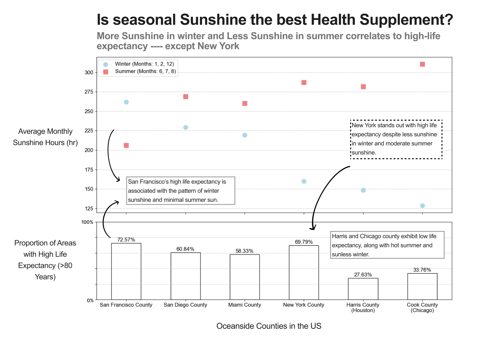
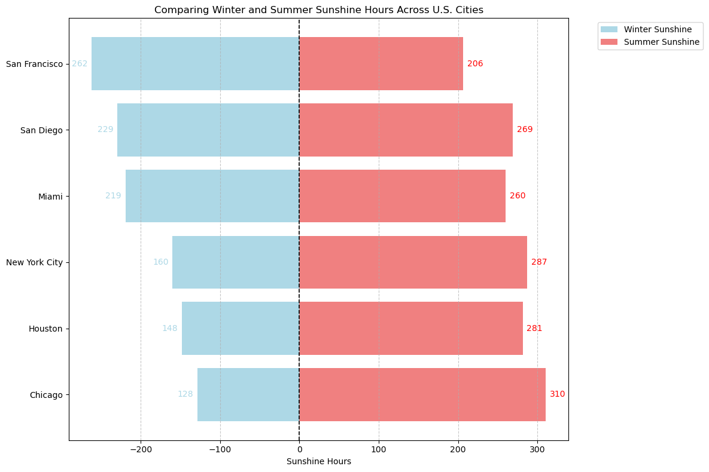
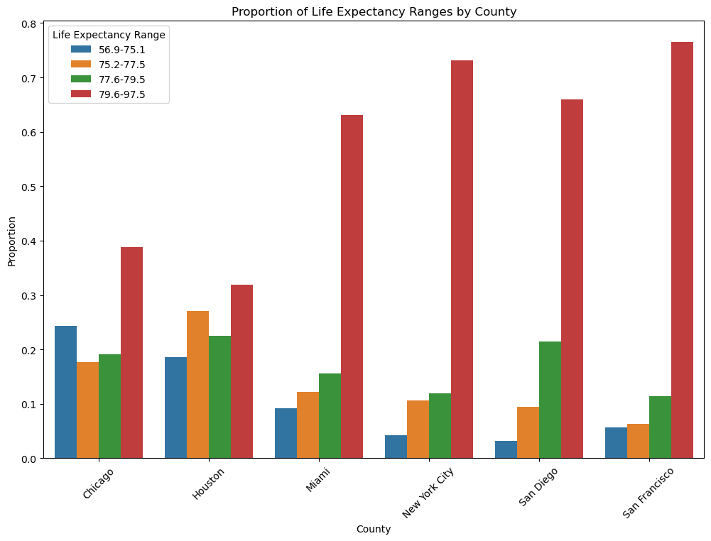
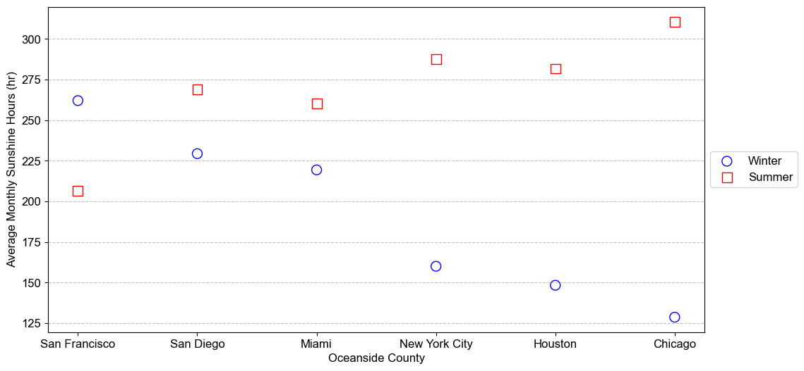
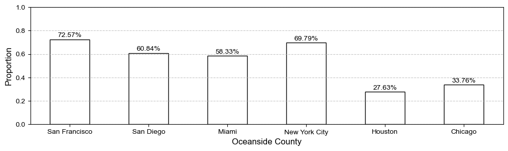

# Project overview
This is a project creating a static visualization of how sunshine impact the life expectancy in US. In this project, we will explore and visualize two datasets: [climate dataset](https://www.usclimatedata.com/) and [US Life Expectancy at Birth](https://www.cdc.gov/nchs/data-visualization/life-expectancy/index.html). 

The climate dataset contains information of the climate in major U.S. Cities.

The data contains in total 7 columns:
- **`city`**: The name of the city.
- **`lon`**: The longitude of the city.
- **`lat`**: The latitude of the city.
- **`month`**: The name of a month (Jan, Feb, etc.).
- **`monthnum`**: The number of a month (1, 2, etc.).
- **`sunshine`**: The average hours of sunshine observed during that month.
- **`rain`**: The average inches of rain observed during that month.

The US life Expectency dataset contains information of the life expectancy of each US County

The data contains in total 6 columns:
- **`State`**: US states
- **`County`**: Specifies the county (and state) associated within the US states
- **`Census Tract Number`**: A unique identifier for the census tract within the county. Census tracts are small, relatively permanent statistical subdivisions of a county.
- **`Life Expectancy`**: Represents the average life expectancy at birth for individuals in the given census tract, measured in years.
- **`Life Expectancy Range`**: The range of life expectancy values (e.g., lower and upper bounds) observed within the census tract, indicating variability in life expectancy.
- **`Life Expectancy Standard Error`**: The standard error of the life expectancy estimate, which measures the precision of the life expectancy data. Smaller values indicate more reliable estimates.

# Key finding from exploratory data analysis
---
## Major Findings

- San Francisco tends to have the most sunshine in winter and least in summer

- Counties with higher average sunshine hours tend to have higher life expectancy.
- San Francisco tends to have the best life span

## Trival Findings
- Miami city has the less flucuation of the sunshine acorss year
- Chicago city has the most flucuation of the sunshine amount across year
- all the avaliable city is located near the oceanside
- left of US tend to have less rainfall, and right of US tend to have more rainfall
- the rain fall season in San Diego and San Francisco is at the beginning and the end of the year, whiles other 4 citities are exactally opposite

# Thinking process on data visualization
---
- research Question: How does seasonal sunshine impact peoples' health in the US oceanside cities
- subtitle: San Francisco with proper seasonal monthly sunshine hour makes its citizen have the highest average life expectancy

Data type:
- oceanside City: Nominal data
- Average monmthly sunshine: Quantitative Ratio
- season: Ordinal
- life expectancy: Quantitative Ratio
- life expectancy category: Ordinal

vis on weather data
mark: dot
- color: blue for winter season and red for summer season
- shape: circle for winter season and square for summer season
- x-axis: oceanside city
- y-axis: sunhine hour

vis on life expecetancy
- mark: stacked-bar
- color: proportion of the area is that above or below the US average life expectancy 77
- x - axis: oceanside city
- y - axis: proportion 0 to 1

As a result, we get the following to visualization:

